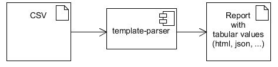

# template-parser

A commandline client for parsing thymeleaf based templates. It loads a variable file + a data csv file which can be looped over in the template in the thymeleaf context.



# Example

Create a html report based on `src/main/resources/templates/report.html` in directory `target/outfile.html`.

```bash
export CLASSPATH=...
java de.sz.thymeleaf.cmd.Main \
  --template report.html \
  --out target/outfile.html \
  --variable src/test/resources/variables.properties \
  --data src/test/resources/data.csv \
  --static src/test/resources/static"
```

# Options

```
java de.sz.thymeleaf.cmd.Main --help
 --data FILE           : a text/csv file, where data is read from, expected tab
                         separated with headlines
 --encoding VALUE      : encoding for writer (Default: UTF-8)
 --locale VALUE        : template engine locale (Default: en)
 --out FILE            : write into this file
 --static FILE         : directory with static resources, if set copy them next
                         to outfile
 --template VALUE      : name of template from classpath to use
 --template-type VALUE : txt, html or xml (Default: html)
 --variables FILE      : properties file, where data is read from
 --zip                 : if set, out file is included with all required
                        resources in a file <out>.zip, requires
                        --staticResources (Default: false)
```

# Configuration

The configuration values are written in the `--properties file` specified. These specifal values are recognized:

| Key | Default | Meaning | 
|:- |:-|:-|
|CSVCONFIG.delimiter|`,` | set Field delimiter to use, e.g. \u0009 for TAB |
| CSVCONFIG.variable_name | `D` | name under which data iterator should be available in template context |

Templates must be located in the classpath in subdirectory `templates`.

# Compile

```
mvn clean package     # compile, run unit tests, create jar file
mvn assembly:assemble # to create a zip file with all dependencies for distribution
```
